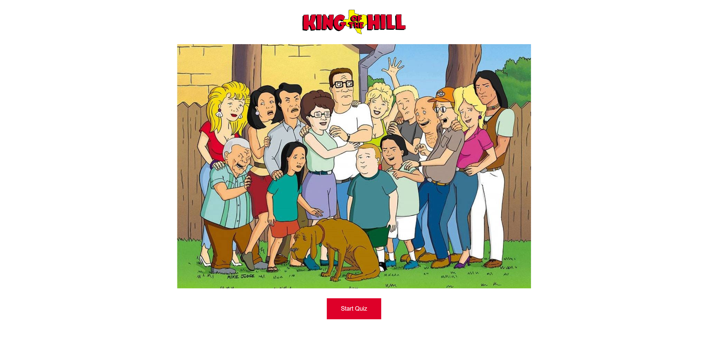

# Trivia Game

## About
This trivia game will test a user's knowledge of the popular TV show King of the Hill. This quiz consists of 12 questions. Users are given 30 seconds to answer each question.

## How to use
To Start the quiz, press the start button on the main page located [here](http://crystalodi.github.io/Trivia-Game)

For each question, there are four answers a user can choose from and a 30 second timer above each question.

If the user selects an answer or leaves the question blank after the timer reaches zero, the user is taken to a page that shows whether or not the question was answered correctly, a youtube video clip related to the question, the correct answer, and a button to take go to the next question.

After all 12 questions are shown to the user, a results screen displays how many questions were answered correctly, incorrectly, or left blank and a button to retake the quiz.

## Technologies Used
* JQuery
* HTML5
* CSS
* Embedded Youtube Videos

