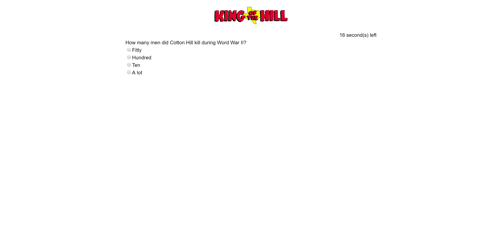

# Trivia Game

Trivia Game is an application that tests a user's knowledge of the popular TV show King of the Hill. This quiz consists of 12 questions and users are given 30 seconds to answer each question.

## Live Version

Go [here](https://crystalodi.github.io/Trivia-Game/) to view the app. 

## About the Application

## Getting Started

These instructions will get you a copy of the project up and running on your local machine.

### Prerequisites

Install the following programs if they aren't on your local machine.

GIT - https://git-scm.com/book/en/v2/Getting-Started-Installing-Git

### Installing

Open your terminal and clone [this](https://github.com/crystalodi/Trivia-Game.git) repository to your computer. 

```
git clone https://github.com/crystalodi/Trivia-Game.git

```

Navigate to the `/Trivia-Game` directory with your terminal

```
cd Trivia-Game
```

Open file explorer from the `/Trivia-Game` directory

```
explorer .
```

Open the `index.html` file by double clicking on it. The app will open in a web browser and should look like this:


### Folder Structure

After following the instructions in the installation section, the contents of the `/Trivia-Game` will look like this

```
│   index.html
│   README.md
│
└───assets
    ├───css
    │       reset.css
    │       style.css
    │
    ├───img
    │       home.jpg
    │       King-of-the-Hill-logo.png
    │       last_image.jpg
    │       quizQuestion.png
    │       quizQuestion_AnswerRight.png
    │       quizQuestion_AnswerWrong.png
    │       resultspage_sc.png
    │       start.jpg
    │       startpage_sc.png
    │
    ├───javascript
    │       app.js
    │
    └───sounds
            koth_theme.mp3
```

* `index.html` Contains the ui for the front end. Contains placeholder divs which will hold content for quiz start page, questions, answers, and results

* `css/reset.css` Removes default styling applied by different browsers.

* `css/style.css` Styling for Start Page, Question page, Answer Page, and results Page.

* `/img` Contains images displayed before quiz starts and displayed on the results Page.

* `/sounds` Contains mp3 file of King Of the Hill theme that plays when application is loaded and stops when the Start Quiz button is clicked.

* `assets/javascript/app.js` generates question and radio buttons, answer explanation page, quiz score page, and initalizes 30 second timer for each question using jQuery.


## How to use

### Start Quiz
To Start the quiz, press the start button on the home page.


For each question, there are four answers a user can choose from and a 30 second timer above each question.


### Answering a Question and Viewing the Right Answer
If the user selects an answer or leaves the question blank after the timer reaches zero, the user is taken to a page that shows whether or not the question was answered correctly, a youtube video clip related to the question, the correct answer, and a button to take go to the next question.


### Results Page

After all 12 questions are shown to the user, a results screen displays how many questions were answered correctly, incorrectly, or left blank and a button to retake the quiz.


## Built With

* HTML
* jQuery
* JavaScript
* CSS

## Authors

* **Crystal Odi** - *Initial work* - [crystalodi](https://github.com/crystalodi)


## Acknowledgments

* W3Schools Documentation
* jQuery Documentation